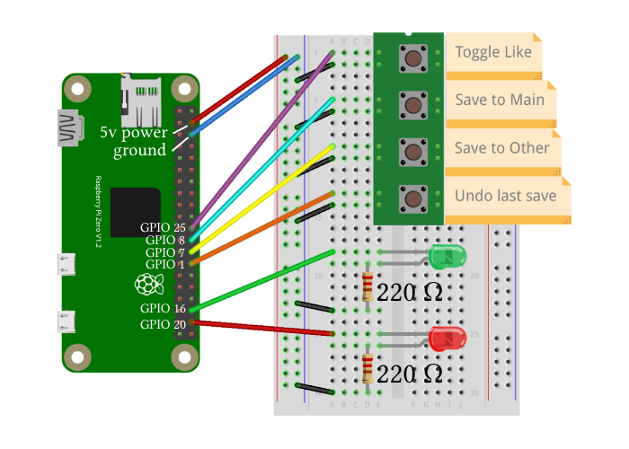

# Spotify-QuickSave :zap: :notes:
[](https://www.gnu.org/licenses/gpl-3.0)
[](https://www.python.org/)
[](https://www.raspberrypi.com/)
[](https://developer.spotify.com/dashboard)

Welcome to **Spotify QuickSave**! The Raspberry Pi-powered Python app designed to enhance your music listening experience. It enables quick and effortless song saving with a quick button press, minimizing interruptions to your workflow.

I found that when I was doing work while listening to a new playlist, I would keep finding new songs I loved and wanted to save to my library. The problem with that is having to switch to Spotify on almost every new song to add it to my library was very disruptive to my workflow. This drove me to create **Spotify QuickSave**. With QuickSave, all it takes is a quick press of a button and the currently playing song gets quickly saved to your library and previously specified playlist. If you for some reason change your mind about saving that song, you can easily undo the last save with the push of another button.

It that's easy! This allows you to effortlessly save the songs you love while you're browsing the web, doing homework, working on a project, etc. I actually found myself constantly needing QuickSave **_while_ I was developing it,** and I'm even using it as I write this README.

Note that a Raspberry Pi is not necessary to run this app and you won't be missing out on any features by not having one. It can be instead ran using hotkeys (buggy) or just the console. The methods, setup, and usage of each method are explained in detail below in the [**Getting Started**](#getting-started-rocket) section.

Ready to give it a try? Download the repo and follow the instructions below to get started!

## License :penguin:
**Spotify QuickSave** is released under the [GNU General Public License v3.0](https://www.gnu.org/licenses/gpl-3.0.en.html). See the [LICENSE](LICENSE) file for more details.

## What I Learned :books:
- Designing very robust system architecture, learning software design patterns such as "Dependency Injection"
- Working with Raspberry Pis and wiring circuits with buttons and LEDs
- Triggering system notifications
- Detecting hotkeys/keyboard shortcuts

## Getting Started :rocket:

### Prerequisites :package:
Before you can run the project, make sure you have the following dependencies installed:
- Python 3.7 or higher _(you can try using lower)_
- [Spotipy](https://pypi.org/project/spotipy/) | Spotify API wrapper | `pip install spotipy`
- [GPIO Zero](https://pypi.org/project/gpiozero/) | Raspberry Pi | `pip install gpiozero`
- [Pynput](https://pypi.org/project/pynput/) | Keyboard hotkeys | `pip install pynput`
- [Plyer](https://pypi.org/project/plyer/) | System notifications | `pip install plyer`

The dependencies you need, besides _Spotipy_, depend on how you're running the app.
- Raspberry Pi: GPIO Zero
- Console: Plyer _(optional)_
- Hotkey: Plyer _(optional but recommended)_ and Pynput

### Installation & Setup :hammer_and_wrench:
To install the project, you can simply clone the repository to your local machine:
```bash
git clone https://github.com/GeorgeD88/Spotify-QuickSave.git
```

To use the application, you'll need to obtain your Spotify API keys, which you can do on the [Spotify Developer Dashboard](https://developer.spotify.com/dashboard).  
Follow these steps if you need help:
1. Go to the [Spotify Developer Dashboard](https://developer.spotify.com/dashboard) and log in with your Spotify account.
2. Click on the _"Create an App"_ button and fill out the required fields.
3. After creating the app, open the _"Settings"_ tab to view your client ID and secret, you'll need them in the next step. While you're here, you'll also need to add http://localhost:8888/callback to the Redirect URIs of your app.

Once you have your client ID and secret, open the `creds_template.py` file in the project directory and replace the marked variables with your client ID and secret (_the variables are marked with "fill this in" comments)._  Then rename the file to `creds.py` to complete the API setup.

### Raspberry Pi Setup
If you're going to use a Raspberry Pi, you're going to need to do a bit more setup first. The app requires you to wire 4 buttons and 2 LEDs (1 green & 1 red). Below is a schematic of how I wired the circuit (the resisters are 220Ω), but you can technically wire it however you like -- as long as go into the files `raspi_listener.py` & `raspi_notifier.py` and switch the GPIO pins with the pins you used. But if you do wire it your own way, **DO SO AT YOUR OWN RISK**, because electronics can be dangerous and you may damage your hardware if you're not sure what you're doing. It's not that difficult, I just mean make sure you do proper research and exercise caution.



Once it's all wired, just download the files to your Pi and make sure to install the required dependencies, `GPIO Zero` and `Spotipy`, and you're almost there!

### Usage :technologist:
Below I describe the usage for all 3 methods: Raspberry Pi, hotkeys, and console. I don't recommend the hotkey method because it's buggy and just decides to stop working randomly, but the console method is very reliable. The only problem is that you have to enter your input into the console and press enter, but that's still significantly easier and quicker than doing it all manually on Spotify.

First I'm going to describe the general functionality of the app as it applies to every input method, then I'll specify how to use each method of input.

The functions of the app are
- Toggle Like: Likes/unlikes the currently playing song. In Spotify, this means saving/unsaving it to your library.
- Save to Main: Saves the currently playing song to the **"main"** playlist.
- Save to Other: Saves the currently playing song to the **"other"** playlist.
- Undo Last Save: Undoes the last save by unliking the song and removing it from the playlist it was saved to (main or other).
- Quit and Export: This quits the app and exports to a file a list of the songs saved during the session.

Below is a deep dive into each of the functions mentioned above. It's a bit lengthy, but I feel like they're pretty important to the usage and would recommend reading them, plus it really doesn't take long at all to read. If you'd still like to skip it, then you can continue straight to the specific instructions for each input method: [Raspberry Pi](#raspberry-pi), [hotkeys](#hotkeys), and [console](#console).

QuickSave allows you to save to 2 different playlists, **main** and **other**. The way it should be used is that if you're listening to a new playlist filled with songs of a certain genre/vibe, you would define the **"main"** playlist to be your own playlist of that same genre/vibe. Every time a new song you like comes up and you save it, it saves it to your own playlist of that same genre/vibe.

The thing is you might not always agree on a song being the genre that a playlist says it is, but you'd still like to save it. The solution to this is the **"other"** playlist, where you save any songs that do not belong to the main playlist's genre/vibe. What should happen is that if you're listening to a playlist of some genre, then most songs should be of that genre, so you can save them without worry. But for the once in a while song that doesn't match, you save it to the **"other"** playlist. The result is that only a few songs won't match the main playlist and would have to go to the **"other"** playlist, so it's very easy to later organize those songs to the correct places after your listening/work session.

Every time you run the app, you have to paste the link (or Spotify ID) for each playlist into the console when prompted. If you don't want to have to input the playlists on every run because you're just going to be using the same playlists every time, then follow these steps: go into the `app.py` file, find the input statements that get the "main" and "other playlist" links/IDs, and replace the input statements with the IDs of your permanent playlists. To get the ID of your playlist, you can extract it from the playlist link. The ID will be sandwiched in between `playlist/` and a stupidly long query `?...` or just nothing after: `https://open.spotify.com/playlist/ PLAYLIST_ID_HERE ?...`

Once you have your playlist ID, this is what the adjusted code should look like.

```python
    main_playlist = "37i9dQZF1DWVA1Gq4XHa6U"
    other_playlist = "37i9dQZF1DX186v583rmzp"

    # convert inputs to Spotify playlist IDs if links were given
    """ if main_playlist[:4] == 'http':
        main_playlist = utils.spotify_id_from_link(main_playlist)
    if other_playlist[:4] == 'http':
        other_playlist = utils.spotify_id_from_link(other_playlist) """

    # initialize the main quick saver component and start the input listener
    print('starting QuickSave app!')
```

The code in between the playlist IDs and initializing the app won't be needed because you would've extracted the IDs yourself. But I advise against deleting it because you might want to revert it, so just comment it out as seen above.

Now besides the two most important save functions, we have a few other important features. One is **"Undo Last Save".** This is for when you save a song but for whatever reason change your mind and want to undo your change. Just press **Undo Last Save** and the last song you saved will be removed from whatever playlist it was saved to, as well as unliked (removed from your library). Note that there's a max undo, because the point of the feature is to undo an accidental save, not to make lots of adjustments. So after saving a song, you can undo once if you'd like.

We also have **Toggle Like**, so you can like/unlike the currently playing song. This allows you to only save the song to your library (which is what liking a song does), rather than saving it both to a playlist and your library. You could also save it to a playlist, and then toggle the like off to only save the song to a playlist.

Lastly we have **Quit and Export**. This is available for the hotkey and console option, but not the Raspberry Pi yet -- I might add it in the future. This simply quits the app, but before doing so, exports a log of the songs added during the session. You can kill the app by just exiting without using this function, you just won't have a log exported.
***

Now that we've gone through all the functions in details, we're finally ready to run Spotify-QuickSave. Below is a guide on every way to run the app. Most importantly, you'll have to switch the class/components that are used to initialize the `QuickSaver` instance in the main `app.py` file, for every usage.

#### Raspberry Pi
The Raspberry Pi usage is very simple, as long as you've followed the [RasPi Setup](#raspberry-pi-setup) instructions above and wired the circuit properly. I've left `app.py` to be set up for the RasPi by default, because that's what it was made for. But just so you know what's going on anyways, to initialize `QuickSaver` for a RasPi you'll need to import the RasPiListener for inputs, as well as the RasPiNotifier for LED alerts. Below are only the parts of the `app.py` code that reflect what was described.
```python
# import these modules
from raspi_listener import RasPiListener
from raspi_notifier import RasPiNotifier

# pass these classes as arguments
quicksaver = QuickSaver(RasPiListener, RasPiNotifier, ...)
```

Then make sure the Pi has internet access (for the API) and simply run the app in the terminal -- through SSH for example. Then use the Pi as previously described, and use the schematic as a guide for each button's function. I recommend writing them on a sticky note and sticking it right beside the buttons, labeling each function.

#### Hotkeys
To use QuickSave with hotkeys, make the changes below to the `app.py` code:
```python
# import these modules
from hotkey_listener import HotKeyListener
from system_notifier import SystemNotifier  # system notifications
from notifier_filler import NotifierFiller  # no extra notifs

# pass these classes as arguments
quicksaver = QuickSaver(HotKeyListener, SystemNotifier, ...)
```

For both the hotkey and console method, you have the option of switching between system notifications or console outputs. To do this just import the notifier you prefer, `SystemNotifier` or `NotifierFiller`, and pass it as the argument for the notifier parameter. QuickSaver prints to the console anyways, regardless of how you set it up. So to use console outputs we simply pass a notifier filler that does nothing called `NotifierFiller`. You can use the notifier filler just as a way to silence/not use system notifications, because the console outputs can just be ignored/minimized.

Then simply execute the `app.py` file, and follow this keyboard shortcut guide:
- Use `Alt + T` to **toggle like** of the currently playing song (like/unlike).
- Use `Alt + S` to save the currently playing song to the **main** playlist.
- Use `Alt + O` to save the currently playing song to the **other** playlist.
- Use `Alt + U` to **undo** the last song you saved _(cannot undo more than once per save)._
- Use `Alt + Q` to **quit** and export a log of the songs you added during the session.

#### Console
Last and easiest to set up and use is ol' reliable: the console :technologist:  
To use QuickSave with console input, make the changes below to the `app.py` code:
```python
# import these modules
from console_listener import ConsoleListener
from system_notifier import SystemNotifier  # system notifications
from notifier_filler import NotifierFiller  # no extra notifs

# pass these classes as arguments
quicksaver = QuickSaver(ConsoleListener, SystemNotifier, ...)
```

Here you have the same notifier options as the hotkey method, so just look at the paragraph in the [hotkey section](#hotkeys) on switching the notifier being used.

Then simply execute the `app.py` file, and follow this input guide. Type the desired letter and press `Enter` to execute each function:
- `T` to **toggle like** of the currently playing song (like/unlike).
- `S` to save the currently playing song to the **main** playlist.
- `O` to save the currently playing song to the **other** playlist.
- `U` to **undo** the last song you saved _(cannot undo more than once per save)._
- `Q` to **quit** and export a log of the songs you added during the session.

And that's all it takes!  
_One last thing before you get on with your jamming, there's some specific behavior to note that is specified below._

### Specific App Behavior to Keep in Mind! :mag:
- QuickSave fetches the songs in your playlist at the start of each run of the app, and saves it in a local list. This list is used to keep track of the songs in your playlists to avoid adding duplicates, but the list is **NOT updated throughout the run of the app.** Meaning it does not re-fetch the songs from Spotify as you use the app, it only keeps track of the songs added using QuickSave. So if you remove or add a song manually from Spotify while the app is running, it will not account for that during the run, so be careful.
- If you'd like to add a song to the playlist but not "like" it (save to library), then you can press the save button and then toggle the like to remove its like.
- QuickSave will always like a song when saving, even if it's a duplicate in a playlist. This is because liking a liked song does not save a duplicate or return an error, but nothing changes. I just want to note this behavior.

That's it! Now you're ready to use **Spotify-QuickSave** and get to jamming :headphones: :notes:
